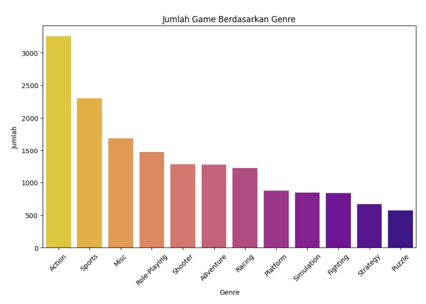
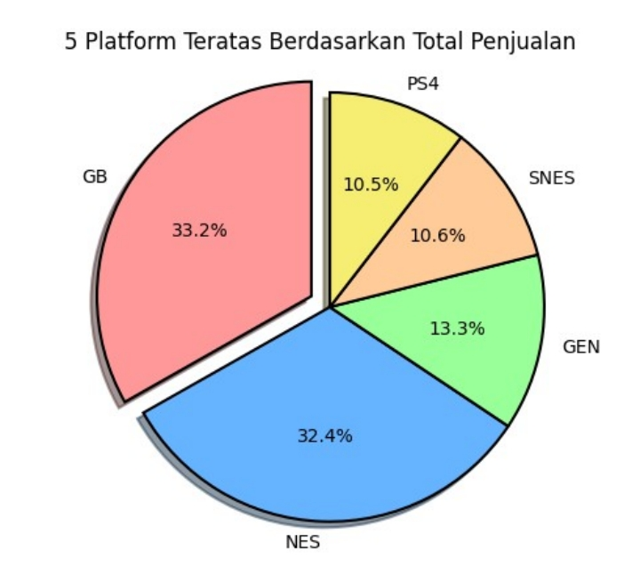
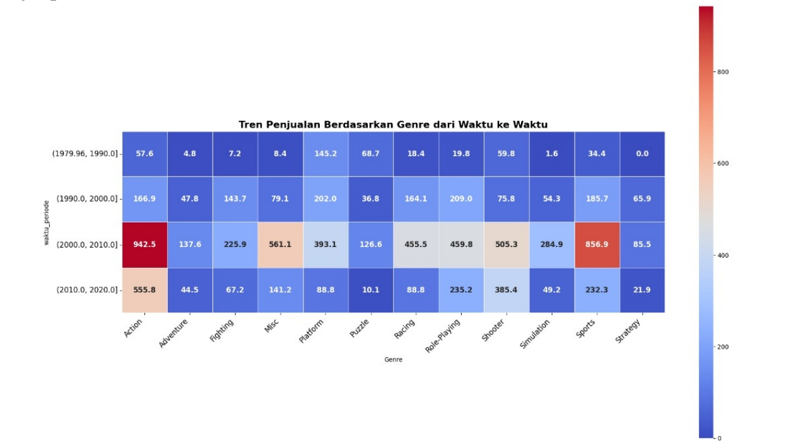
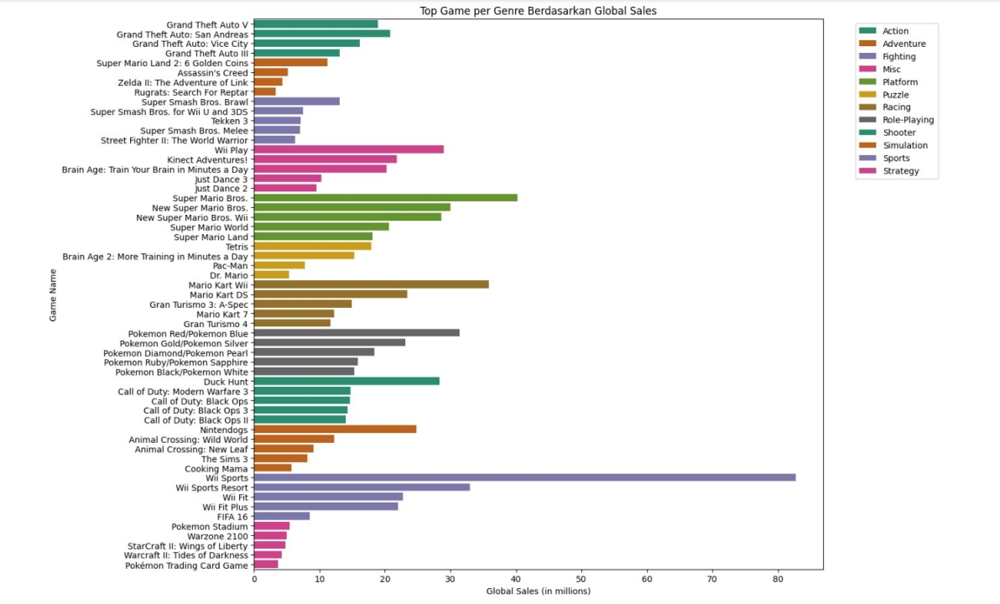
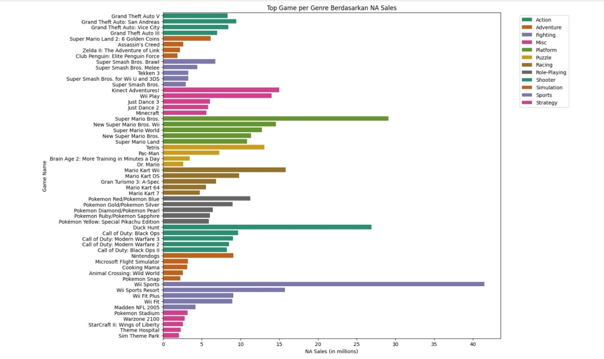
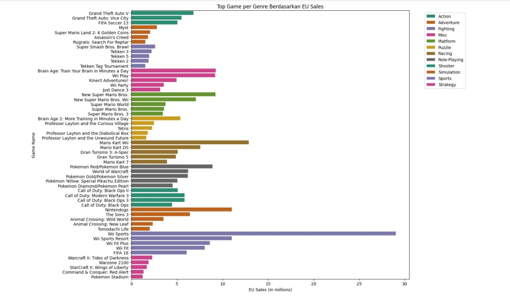
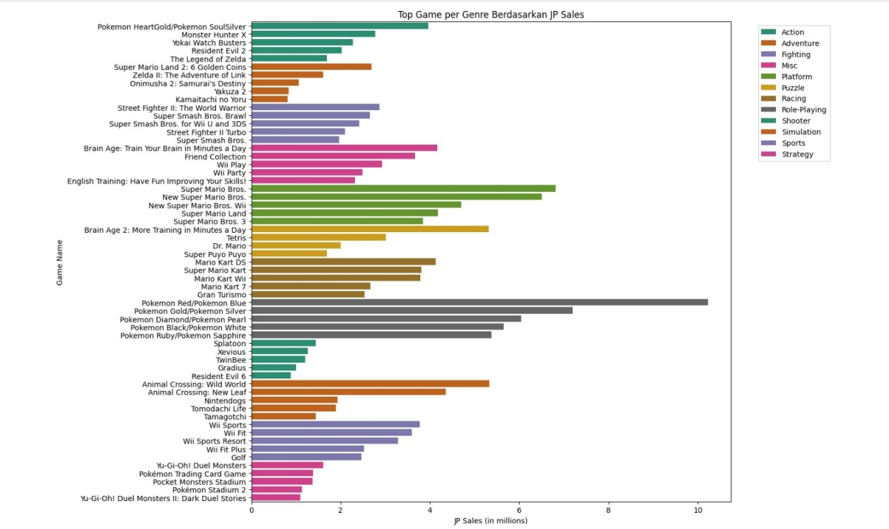
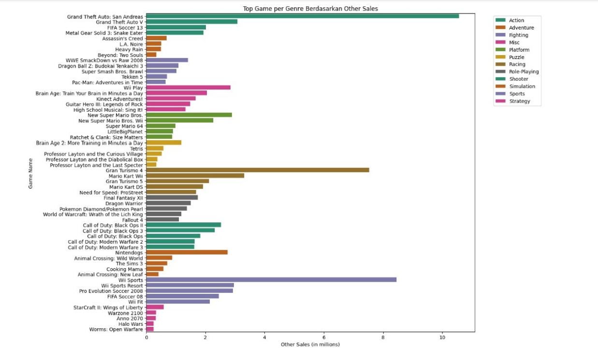

<h1 align="center">🎮 Video Game Sales Analysis</h1>

<p align="center">
Exploratory Data Analysis (EDA) of Global Video Game Sales using Python
</p>

<p align="center">


</p>

---

# 📖 Project Overview

The video game industry has generated billions of dollars in revenue worldwide across multiple gaming platforms and regions. Understanding historical sales trends helps identify market opportunities, consumer preferences, and platform performance.

This project performs an **Exploratory Data Analysis (EDA)** on the **Video Game Sales** dataset using Python. The analysis focuses on uncovering sales trends, identifying the best-selling platforms, understanding genre popularity, and comparing regional sales performance through statistical analysis and data visualization.

This project was developed as part of the **Data Science Algorithms** course at **Universitas Bina Sarana Informatasi** and demonstrates practical skills in data cleaning, visualization, and business insight generation.

---

# 🎯 Business Objectives

The objectives of this project are to answer the following business questions:

- Which gaming platform has generated the highest global sales?
- Which game genres dominate the market?
- How have video game sales changed over time?
- Which regions contribute the highest sales?
- Which games perform best across different markets?

---

# 📂 Dataset

### Dataset

**Video Game Sales Dataset**

📥 **Source**

https://www.kaggle.com/code/kotsop/video-game-sales-analysis-eda-ml

📒 **Google Colab Notebook**

https://colab.research.google.com/drive/1LGuvtLcYH-D10MLp59QtODjCu5dTuw70

### Dataset Summary

- Approximately **16,500+ records**
- 11 variables
- Multiple gaming platforms
- Worldwide sales information

| Feature | Description |
|----------|-------------|
| Name | Video Game Title |
| Platform | Gaming Platform |
| Year | Release Year |
| Genre | Game Genre |
| Publisher | Game Publisher |
| NA_Sales | North America Sales |
| EU_Sales | Europe Sales |
| JP_Sales | Japan Sales |
| Other_Sales | Other Regions Sales |
| Global_Sales | Worldwide Sales |

---

# 🛠️ Technologies Used

- Python
- Google Colab
- Pandas
- NumPy
- Matplotlib
- Seaborn

---

# 🔄 Data Analysis Workflow

```text
Business Understanding
        │
        ▼
Data Collection
        │
        ▼
Data Cleaning
        │
        ▼
Exploratory Data Analysis
        │
        ▼
Data Visualization
        │
        ▼
Business Insights
```

---

# 📊 Analysis Performed

- ✔ Data Cleaning
- ✔ Missing Value Handling
- ✔ Data Type Conversion
- ✔ Descriptive Statistics
- ✔ Platform Analysis
- ✔ Genre Analysis
- ✔ Sales Trend Analysis
- ✔ Regional Sales Analysis
- ✔ Top Selling Games Analysis

---

# 📷 Analysis Results

## 🎯 Number of Games by Genre

<p align="center">

</p>

### Insight

- Action is the most common game genre in the dataset.
- Sports and Misc also have a high number of published games.
- Puzzle and Strategy games appear less frequently.

---

## 🎮 Top 5 Platforms by Global Sales

<p align="center">

</p>

### Insight

- GameBoy (GB) achieved the highest total sales.
- Nintendo platforms dominate the market.
- Platform popularity strongly affects overall sales.

---

## 📈 Sales Trend Over Time

<p align="center">

</p>

### Insight

- Video game sales increased rapidly during the early 2000s.
- The industry reached its highest sales between **2008 and 2010**.
- Sales gradually declined afterward.

---

## 🌍 Regional Sales Comparison

### Insight

- North America generated the largest overall sales.
- Europe followed as the second-largest market.
- Japan showed different purchasing preferences compared to Western markets.

---

## 🏆 Top Selling Games Worldwide

<p align="center">

</p>

### Insight

- Wii Sports dominates global sales.
- Sports games consistently appear among the highest-selling titles.

---

## 🇺🇸 Top Games in North America

<p align="center">

</p>

North American consumers mainly favor Sports and Action games.

---

## 🇪🇺 Top Games in Europe

<p align="center">

</p>

European purchasing behavior closely follows the global sales trend.

---

## 🇯🇵 Top Games in Japan

<p align="center">

</p>

Japanese gamers show stronger preferences for Role-Playing and Nintendo-exclusive titles.

---

## 🌎 Top Games in Other Regions

<p align="center">

</p>

Sales outside North America, Europe, and Japan generally follow the global trend with lower total volumes.

---

# 💡 Key Findings

- 🎮 **GameBoy (GB)** recorded the highest platform sales.
- 🎯 **Action** is the most common game genre.
- 📈 The gaming industry peaked between **2008–2010**.
- 🌍 **North America** contributed the largest share of global sales.
- 🏆 **Wii Sports** remains one of the highest-selling games worldwide.

---

# 🚀 Skills Demonstrated

This project demonstrates practical skills in:

- Exploratory Data Analysis (EDA)
- Data Cleaning
- Data Wrangling
- Data Visualization
- Statistical Analysis
- Business Understanding
- Data Storytelling
- Python Programming
- Pandas
- NumPy
- Matplotlib
- Seaborn

---

# 📁 Repository Structure

```text
video-game-sales-analysis/

│── README.md
│── vgsales.ipynb
│── vgsales.csv
│── images/
│   ├── genre_distribution.jpg
│   ├── platform_sales.jpg
│   ├── sales_trend.jpg
│   ├── global_top_games.jog
│   ├── na_top_games.jpg
│   ├── eu_top_games.jpg
│   ├── jp_top_games.jpg
│   └── other_top_games.jpg
```

---

# 🔮 Future Improvements

Potential future enhancements include:

- Develop a Machine Learning model to predict future game sales.
- Build an interactive dashboard using Power BI.
- Create a Looker Studio dashboard.
- Analyze publisher performance.
- Perform time series forecasting.
- Conduct customer segmentation based on gaming preferences.

---

# 👨‍💻 Author

## Nico Alfianto

**Information Systems Student | Data Analyst Enthusiast**

📧 Email  
alfiantonico9@gmail.com

💼 LinkedIn  
https://www.linkedin.com/in/nico-alfianto

🐙 GitHub  
https://github.com/nico-alfianto

---

## ⭐ Support

If you found this project helpful or interesting, consider giving this repository a **Star ⭐**.

Thank you for visiting!
````
